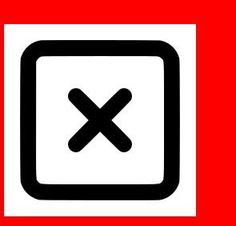
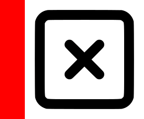

# Output Image Resizing

Resizing options to perform on the image before output.

- [`extend()`](#output-image-extend)

---

<a id="output-image-extend"></a>

### extend()

Extends/pads the edges of the image with the provided background colour.

#### Usage

```js
Svg2("path/to/svg/example.svg")
.png()
.extend({ top: 33, right: 12, bottom: 10, left: 100, background: "#ffffff" })
.toFile("path/to/save/example.png")
.then(() => {
    console.log("done");
})
.catch((err) => {
    throw err;
});
```

##### Parameters

- `options` ([**Object**](https://developer.mozilla.org/en-US/docs/Web/JavaScript/Reference/Global_Objects/Object) | [**Number**](https://developer.mozilla.org/en-US/docs/Web/JavaScript/Reference/Global_Objects/Number)): containing the available options to perform on the image before outputing it.
    - `top` ([**Number**](https://developer.mozilla.org/en-US/docs/Web/JavaScript/Reference/Global_Objects/Number)): Extend the top part of the output image. **default(0)**
    - `right` ([**Number**](https://developer.mozilla.org/en-US/docs/Web/JavaScript/Reference/Global_Objects/Number)): Extend the right part of the output image. **default(0)**
    - `bottom` ([**Number**](https://developer.mozilla.org/en-US/docs/Web/JavaScript/Reference/Global_Objects/Number)): Extend the bottom part of the output image. **default(0)**
    - `left` ([**Number**](https://developer.mozilla.org/en-US/docs/Web/JavaScript/Reference/Global_Objects/Number)): Extend the left part of the output image. **default(0)**
    - `background` ([**String**](https://developer.mozilla.org/docs/Web/JavaScript/Reference/Global_Objects/String)): Extension background **[hexadecimal](https://en.wikipedia.org/wiki/Web_colors#Hex_triplet)** color. **default("#ffffff")**


> If you provide a `Number` to `options` it will change all sides e.g `extend(50)` will extend all sides by 50.

##### Throws

- [**TypeError**](https://developer.mozilla.org/en-US/docs/Web/JavaScript/Reference/Global_Objects/TypeError): if `parameters` are invalid.

##### Returns

- [**Svg2**](basic-usage/svg2-constructor)

##### Examples

###### Image produced from a `SVG` that we are going to be using in our example


###### Extend | all sides and make the extension background `red`

```js
Svg2("path/to/svg/example.svg")
.png()
.extend({ top: 30, right: 50, bottom: 12, left: 5, background: "#FF0000" })
.toFile("path/to/save/example.png")
.then(() => {
    console.log("done");
})
.catch((err) => {
    throw err;
});
```

`Outputs`



---

###### Extend | all sides

```js
Svg2("path/to/svg/example.svg")
.png()
.extend({ top: 50, right: 50, bottom: 50, left: 50 })
.toFile("path/to/save/example.png")
.then(() => {
    console.log("done");
})
.catch((err) => {
    throw err;
});

// OR

Svg2("path/to/svg/example.svg")
.png()
.extend(50)
.toFile("path/to/save/example.png")
.then(() => {
    console.log("done");
})
.catch((err) => {
    throw err;
});
```

`Outputs`

> Extended area was made `green` for better visibility, if no `background` color is provided it defaults to `white` / `#ffffff`


---

###### Extend | left side only and make the extension background `red`

```js
Svg2("path/to/svg/example.svg")
.png()
.extend({ top: 0, right: 0, bottom: 0, left: 50, background: "#FF0000" })
.toFile("path/to/save/example.png")
.then(() => {
    console.log("done");
})
.catch((err) => {
    throw err;
});

// OR

Svg2("path/to/svg/example.svg")
.png()
.extend({ left: 50, background: "#FF0000" })
.toFile("path/to/save/example.png")
.then(() => {
    console.log("done");
})
.catch((err) => {
    throw err;
});
```

`Outputs`



---
